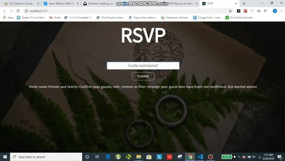

# RSVP

 

[View the live demo](https://jasonpallone-rsvp.com)

If you'd like to view my portfolio, [Click here](https://jasonpallone.com)

# Description

This was one of my first React apps. This is an RSVP app created with React and hand coded CSS. You can add a guest, edit the guest, remove the guest and confirm them. There is a phantom li element that shows the input value while you type, it is removed on submit. There is an option to filter the guests to view only the guests that have confirmed they will attend.

Thanks for checking out my project!

